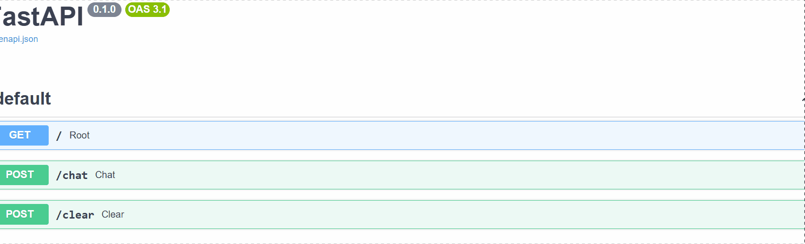

# Ai-Assistant-API

AI Assistant API for answering questions using OpenAI.

## Demo



## Features

1. PostgreSQL database running in Docker

2. Endpoint: /,/chat and /clear

3. Openai api with model chat gpt

4. REST API built with Fast api

5. You can communicate with an Ai-Assistant

6. Persistent chat history

## Stack

Python 3.12,Docker,Postgresql,Git bash,Sqlalchemy,Openai api,Fast API,python-dotenv

## Project structure

```text
app/
├── routers/
├── models/
├── schemas/
├── crud/
├── database.py
├── config.py
└── main.py
```

## Installation

git bash

```
git clone https://github.com/dil2324/Ai-Assistant-API
cd your_project
pip install -r requirements.txt
cp env.example .env

docker compose up --build

uvicorn app.main:app --reload

```
